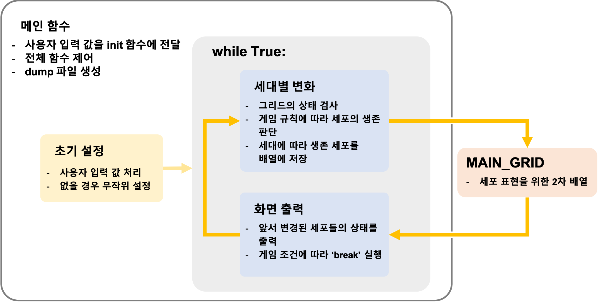

# Game of Life - [Streami] Pre-Test

[Conway's Game of Life](https://bitstorm.org/gameoflife/)을 바탕으로 제작된 세포 분열 게임입니다.

**Developer:** Jihoon Lee


### Category

- [**사용 기술**](#technology)
- [**설치 및 사용법**](#설치-및-사용법)
- [**주요 함수**](#주요-함수)


### Technology [#](#category)

**Language**: Python 3.5

**IDE**: PyCharm CE

**Version control**: github

**Virtual Machine**: Docker(ubuntu16.04)


### 설치 및 사용법 [#](#category)

**유의사항**

1. **무작위 상태**로 시작할 경우 게임의 크기가 **최대 140x100**까지 커질 수 있습니다.

2. 한 화면에 모든 세포를 확인하기 위해 터미널 font의 크기를 줄여주세요.

   

- 본 게임은 **Docker** 환경이 구축된 상태에서 실행할 수 있습니다.

  1. shell terminal에서 **./gol_set.sh** 파일 실행합니다.

  2. 게임을 실행하기 위한 설정이 모두 완료되면 아래의 명령어를 통해 게임 폴더로 이동합니다.

     ```python
     cd /var/www/streami/game_of_life
     # 또는 아래와 같이 바로 게임을 시작할 수 있습니다.
     python3 /var/www/streami/game_of_life/game_of_life.py
     ```

  3. 세 가지 명령으로 게임 시작할 수 있습니다.

     ```python
     python3 game_of_life.py 
     python3 game_of_life.py plus.txt
     python3 game_of_life.py plus.txt 10
     ```

     - **game_of_life.py:** 화면에 무작위로 생성된 셀이 무한히 분할합니다.

       

     - **game_of_life.py plus.txt:** plus.txt에 저장된 셀의 개수만큼 화면에 세포들이 생성되고 무한히 분할합니다.

     - **game_of_life.py plus.txt 10:** plus.txt에 저장된 셀의 개수만큼 화면에 세포들이 생성되고 입력한 숫자만큼 세대가 진행됩니다.

     - 입력한 세대 수 만큼 게임이 진행되고 이때 살아남아 있는 세포들의 상태는 **./game_of_life/dump** 폴더에 텍스트 파일로 저장됩니다.

  4. 입력한 세포가 세대가 진행되는동안 살아있지 못하면 게임은 종료됩니다.

  5. **모든 세포가 죽거나** **'ctrl+c'** 키를 누를 경우 게임은 종료됩니다.


### 주요 함수 [#](#category)

- **전체 흐름** [#](#category)

  


- **초기 설정** [#](#category)

    - **[def initialize(filename, genenration)](https://github.com/navill/streami_homework/blob/bdbbe28bc3f91e8c8bf73a1b8ad0637157c5a992/game_of_life/game_of_life.py#L18)**
        - 사용자가 입력한 설정에 따라 초기값 설정합니다.
        - 입력이 없을 경우 무작위 상태로 게임이 셋팅됩니다.

- **세포의 세대별 변화 처리** [#](#category)

    - **[def create_grid(grid_size, init_cell)](https://github.com/navill/streami_homework/blob/bdbbe28bc3f91e8c8bf73a1b8ad0637157c5a992/game_of_life/game_of_life.py#L63)**

        - 0세대 셀이 적용된 메인 그리드를 생성합니다.

        - 전체 표의 크기는 grid_size에 의해 정해집니다.

            (사용자가 아무런 값을 입력하지 않을 경우 창은 최대 140x100까지 커질 수 있습니다.)

    - **[def check_live_neighbor(cell_row, cell_col)](https://github.com/navill/streami_homework/blob/bdbbe28bc3f91e8c8bf73a1b8ad0637157c5a992/game_of_life/game_of_life.py#L81)**

        - 한 개의 셀을 중심으로 주변을 순회하면서 살아있는 셀을 개수를 파악합니다.

    - **[def change_generation()](https://github.com/navill/streami_homework/blob/bdbbe28bc3f91e8c8bf73a1b8ad0637157c5a992/game_of_life/game_of_life.py#L117)**
      
      - 전체 셀을 순환하며 Game of Life의 게임 규칙에 맞게 셀을 활성화하거나 비활성화 합니다.
        - 위 과정 중 게임의 모든 셀이 죽었는지 판별합니다.

- **화면 출력** [#](#category)
  
    - **[def visualize(gen)](https://github.com/navill/streami_homework/blob/bdbbe28bc3f91e8c8bf73a1b8ad0637157c5a992/game_of_life/game_of_life.py#L160)**
        - 셀의 변화를 표현하기 위해 **sys.stdout.write()**를 이용하여 쉘에 그립니다.
        - 입력된 세대 수에 맞게 반복문이 동작합니다.
        - 세대수가 입력되지 않을 경우 무한 반복 됩니다.
    
- **메인 함수** [#](#category)

    - **[def main(sys_args)](https://github.com/navill/streami_homework/blob/bdbbe28bc3f91e8c8bf73a1b8ad0637157c5a992/game_of_life/game_of_life.py#L212)**

        - shell에서 인가된 두 개의 변수(파일 이름과 세대 수)를 이용해 게임을 초기화하고 실행시키기 위한 함수입니다.

        - 게임 동작에 필요한 함수를 실행하고, 세대가 입력될 경우 마지막 세대의 상태를 저장하는 기능을 포함합니다.

            - 저장될 파일명은 'dump/dump_D00_T00:00:00.txt'로 저장됩니다.

            

