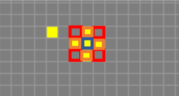
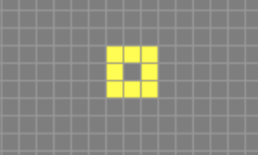
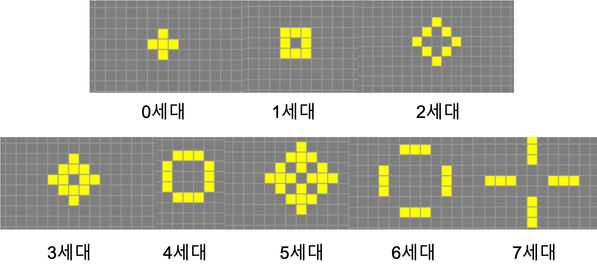

# Game of life - Streami

### 규칙

**공간이 채워져있을 경우**

1. 이웃이 하나 혹은 없을 경우 세포는 죽는다.

2. 네 개 이상의 이웃을 가진 셀은 죽는다.

3. 두 개 혹은 세 개의 이웃이있는 셀은 살아남는다.

**공간이 비워져 있을 경우**

4. 각 셀의 이웃이 세 개일 경우 세포는 살아난다.

**예시**

0 세대(초기값)

- 왼쪽 한 개의 셀은 다음세대에 죽는다(규칙1)
- 붉은색의 셀은 이웃에 세 개의 셀이 살아 있으므로 다음 세대에 살아난다(규칙3)
- 중앙(파란색) 셀은 이웃에 네 개의 셀이 살아 있으므로 다음 세대에 죽는다(규칙2)

- 주황색의 셀은 이웃에 세개의 셀이 살아 있으므로 다음 세대에 살아난다(규칙3)

1 세대

**전체 세대 변화**

